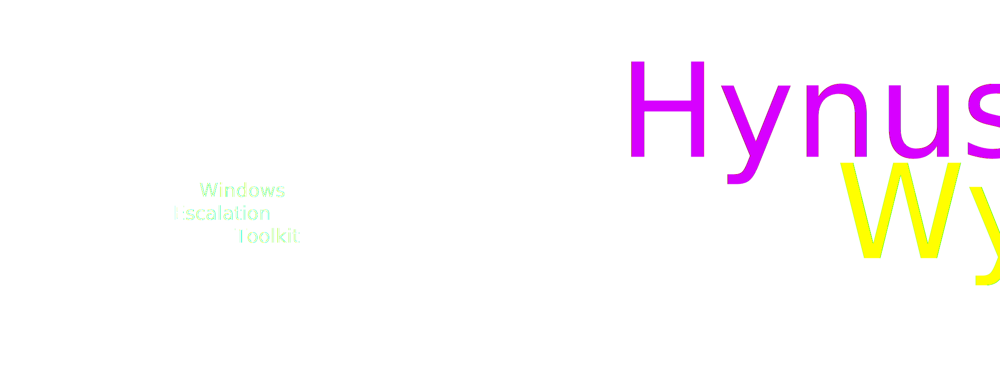

# HynusWynus - Windows Privilege Escalation Toolkit

HynusWynus is a powerful privilege escalation tool for Windows systems designed for educational purposes and ethical hacking (such as penetration testing). It leverages a combination of techniques including process dumping, the execution of custom PEAS (Privilege Escalation Attack Scripts (peas.bat, .ps1, x64.exe)), and credential extraction with Mimikatz.exe. Users can also extend its functionality by creating custom mods using C# .NET Core 7.0.

## Features

- Process dumping for analysis.
- Execution of PEAS (Privilege Escalation Attack Scripts).
- Integration with Mimikatz and work in progress support for mimilib.dll.
- Support for running custom scripts and extensions.
- WIP: Custom mod support for users to expand functionality (Note: Mods are not verified for viruses; use caution).

## Disclaimer

> [!WARNING]  
> **Important:** This tool is intended for educational purposes only and should be used responsibly and ethically. The developer of HynusWynus cannot be held liable for any damage or misuse of this tool. It is your responsibility to ensure compliance with all relevant laws and ethical standards when using this software.
***Use at your own risk.***

---

> [!NOTE]  
> **Note:** This tool should only be used in accordance with applicable laws and ethical standards. Always obtain proper authorization and consent before conducting any security testing on systems you do not own or have explicit permission to test.